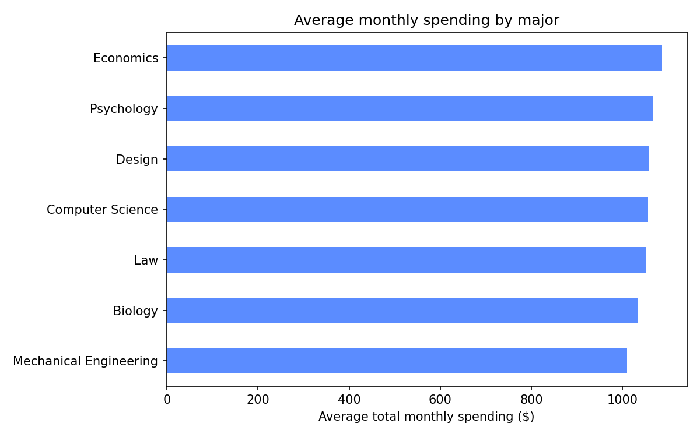
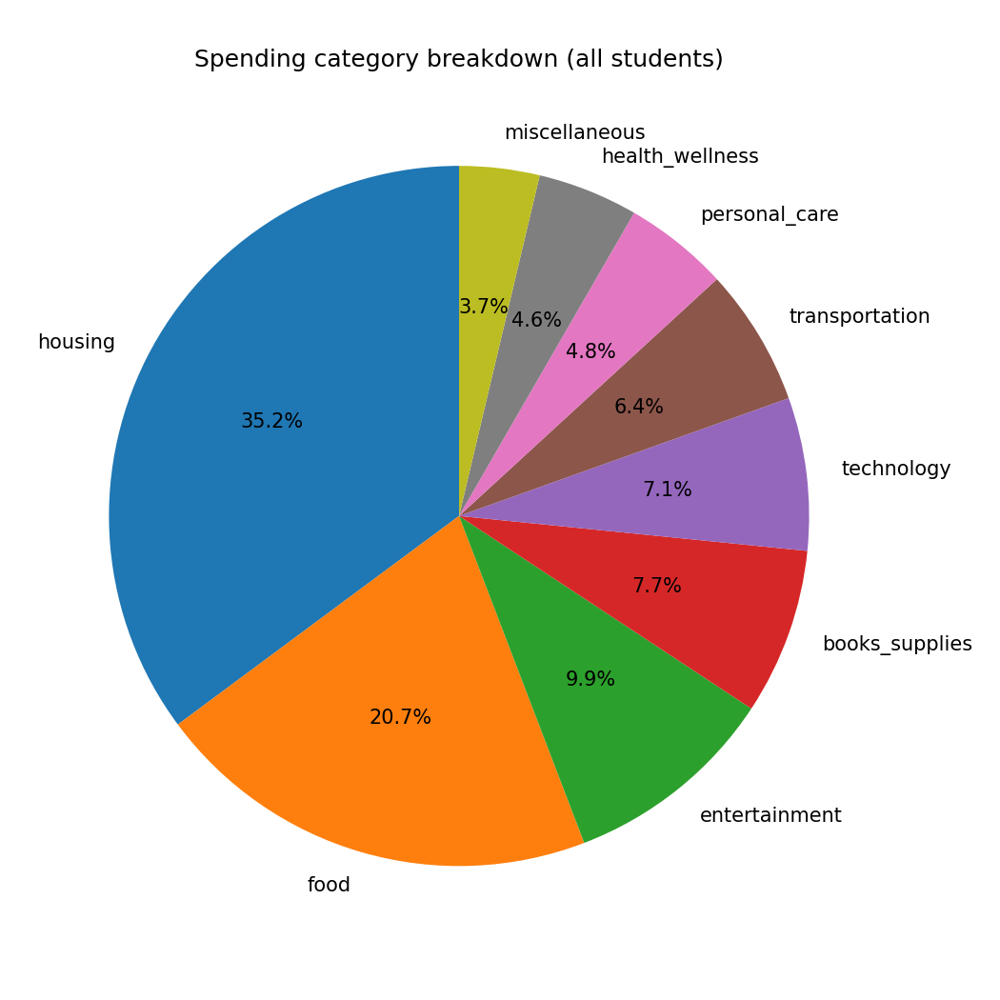

# Student Spending Analysis — Report

Dataset: 400 students (synthetic data, see `generate_data.py`).

## Key findings

- Average total monthly spending across all students: **$1050.55**
- 219 students (54.8%) spend more than their income + aid.
- Highest-spending major: **Economics**
- Lowest-spending major: **Mechanical Engineering**

## Charts

